```{=html}
<div class="feature-toggle">
  <span>View:</span>
  <label class="feature-choice"><input type="radio" name="feature-mode" value="opal"> OPAL</label>
  <label class="feature-choice"><input type="radio" name="feature-mode" value="opalx"> OPALX</label>
  <label class="feature-choice"><input type="radio" name="feature-mode" value="both" checked> Both</label>
</div>
```

::::: {.feature-opal}
## `OPAL-T` Compared with TRANSPORT and TRACE 3D

The first benchmark family compares `OPAL-T` with the envelope and transport
codes TRACE 3D and TRANSPORT.

### TRACE 3D Units and Input

TRACE 3D uses the following phase-space conventions:

- horizontal plane: `x [mm]`, `x' [mrad]`
- vertical plane: `y [mm]`, `y' [mrad]`
- longitudinal plane internally: `z [mm]`, `\Delta p/p [mrad]`
- longitudinal plane for input and output: `\Delta\phi [deg]`, `\Delta W [keV]`

The longitudinal conversions quoted in the appendix are

$$
z = -\frac{\beta\lambda}{360}\,\Delta\phi,
$$ {#eq-benchmarks-trace-z}

and

$$
\frac{\Delta p}{p} = \frac{\gamma}{\gamma+1}\frac{\Delta W}{W}.
$$ {#eq-benchmarks-trace-dpp}

The benchmark input beam is defined in TRACE 3D by the parameters `ER`, `Q`,
`W`, `XI`, `BEAMI`, and `EMITI`. The concrete test case used in the appendix is

```text
ER = 938.27
W = 7
FREQ = 700
BEAMI = 0.0, 4.0,0.0, 4.0, 0.0, 0.0756
EMITI = 0.730, 0.730, 7.56
```

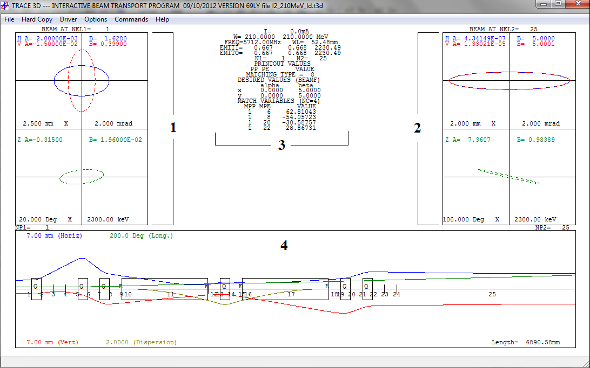{#fig-benchmarks-trace width="90%"}

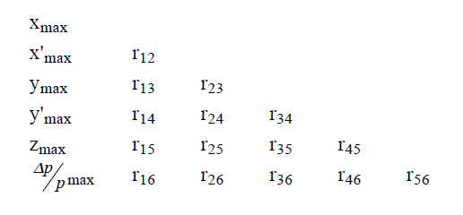{#fig-benchmarks-trace-z width="90%"}

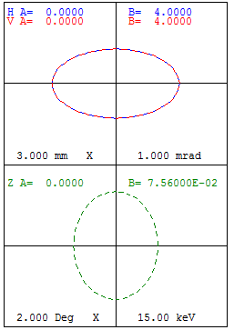{#fig-benchmarks-input-trace width="33%"}

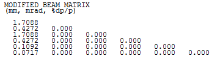{#fig-benchmarks-trace-z-input width="50%"}

### TRANSPORT Units and Input

TRANSPORT uses the standard coordinates:

- horizontal plane: `x [cm]`, `theta [mrad]`
- vertical plane: `y [cm]`, `phi [mrad]`
- longitudinal plane: `l [cm]`, `delta [%]`

The input beam can be taken from the TRACE 3D sigma matrix after changing the
units with the TRANSPORT `card 15` settings documented in the appendix.

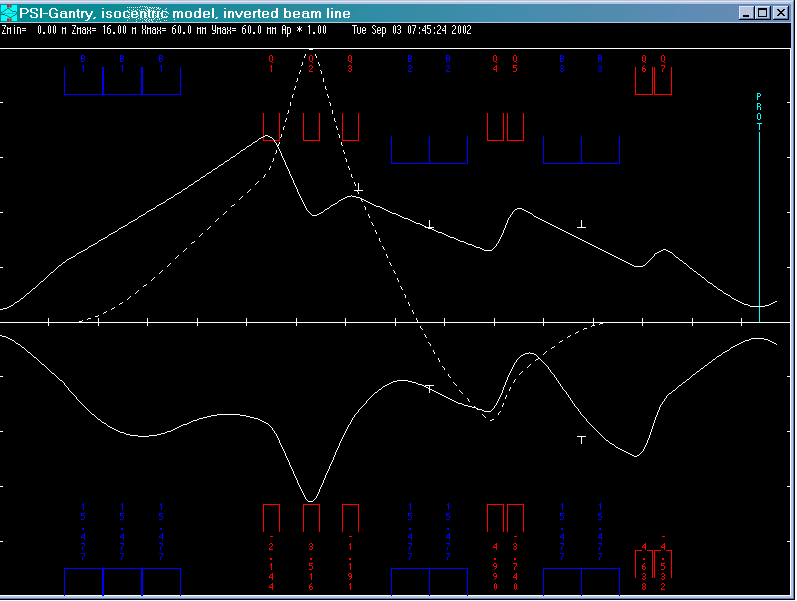{#fig-benchmarks-transport width="90%"}

### Comparison Case

The transport line consists of:

- `DRIFT 1`: `0.250 m`
- one `SBEND` or `RBEND` with `rho = 0.250 m`
- `DRIFT 2`: `0.250 m`

The benchmark discussed in detail is the `SBEND` case with entrance and exit
edge angles.

| TRACE 3D bend parameter | Value | Description |
|---|---:|---|
| `NT` | `8` | type code for bending |
| `alpha` | `30 deg` | angle of bend in the horizontal plane |
| `rho` | `250 mm` | radius of curvature of the central trajectory |
| `n` | `0` | field-index gradient |
| `vf` | `0` | horizontal bend |

| TRACE 3D edge parameter | Value | Description |
|---|---:|---|
| `NT` | `9` | type code for edge |
| `beta` | `10 deg` | pole-face rotation |
| `rho` | `250 mm` | radius of curvature |
| `g` | `20 mm` | total gap |
| `K1` | `0.36945` | fringe-field factor |
| `K2` | `0.36945` | fringe-field factor |

{#fig-benchmarks-trace-sbend width="90%"}

{#fig-benchmarks-transport-sbend width="90%"}

### Beam-Size and Emittance Comparison

The appendix reports agreement at the end of each line element.

| Position | `z [m]` | `sigma_x [mm]` TRACE | `sigma_y [mm]` TRACE | `sigma_x [mm]` TRANSPORT | `sigma_y [mm]` TRANSPORT |
|---|---:|---:|---:|---:|---:|
| Input | 0.000 | 1.709 | 1.709 | 1.709 | 1.709 |
| Drift 1 | 0.250 | 1.712 | 1.712 | 1.712 | 1.712 |
| Edge | 0.250 | 1.712 | 1.712 | 1.712 | 1.712 |
| Bend | 0.381 | 1.638 | 1.587 | 1.638 | 1.587 |
| Edge | 0.381 | 1.638 | 1.587 | 1.638 | 1.587 |
| Drift 2 | 0.631 | 1.206 | 1.264 | 1.206 | 1.264 |

| Position | `z [m]` | `epsilon_x` TRACE | `epsilon_z` TRACE | `epsilon_x` TRANSPORT | `epsilon_z` TRANSPORT |
|---|---:|---:|---:|---:|---:|
| Input | 0.000 | 0.730 | 0.08 | 0.730 | 0.08 |
| Drift 1 | 0.250 | 0.730 | 0.08 | 0.730 | 0.08 |
| Edge | 0.250 | 0.730 | 0.08 | 0.730 | 0.08 |
| Bend | 0.381 | 0.973 | 0.65 | 0.973 | 0.65 |
| Edge | 0.381 | 0.973 | 0.65 | 0.973 | 0.65 |
| Drift 2 | 0.631 | 0.973 | 0.65 | 0.973 | 0.65 |

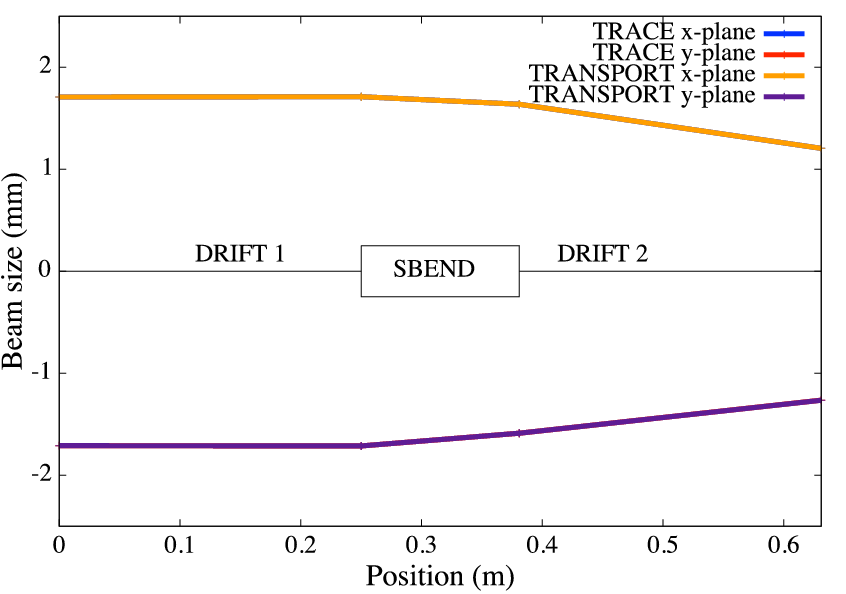{#fig-benchmarks-env width="60%"}

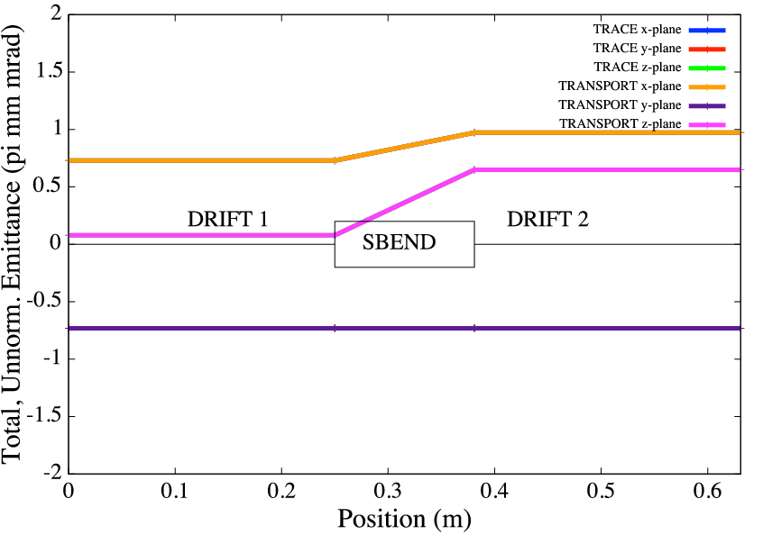{#fig-benchmarks-emi width="60%"}

### Relation to `OPAL-T`

The appendix then maps the TRACE / TRANSPORT setup to `OPAL-T`. The main code
feature comparison is:

| Feature | TRACE 3D | TRANSPORT | `OPAL-T` |
|---|---|---|---|
| simulation type | envelope | envelope | time integration |
| input beam | Twiss, emittance | sigma matrix, momentum | sigma matrix, energy |
| units | `mm-mrad`, `deg-keV` | `cm-rad`, `cm-%` | `m-beta gamma` |

The input distribution conversion quoted by the appendix is

```text
T3D SIGMA                        OPAL -T
-------------------------------------------------------
1.7088 mm             SIGMAX  = 1.7088/sqrt(5)e-3         m
0.4272 mrad           SIGMAPX = 0.4272/sqrt(5)*0.1224e-3
1.7088 mm             SIGMAY  = 1.7088/sqrt(5)e-3        m
0.4272 mrad           SIGMAPY = 0.4272/sqrt(5)*0.1224e-3
0.1092 mm             SIGMAZ  = 0.1092/sqrt(5)e-3        m
0.0717 %              SIGMAPZ = (0.0717*10)/sqrt(5)*0.1224e-3
```

leading to the documented `GAUSS` distribution example.

The `OPAL-T` bend comparison is shown for three cases:

- `SBEND` without edge angles
- `SBEND` with edge angles
- `SBEND` with nonzero field index `K1`

{#fig-benchmarks-opalt-noedge width="90%"}

{#fig-benchmarks-opalt-edge width="90%"}

{#fig-benchmarks-opalt-fi width="90%"}

{#fig-benchmarks-opalt-fi-test width="90%"}

## Hard-Edge Dipole Comparison with ELEGANT

The second benchmark family studies a hard-edge dipole against ELEGANT.
Because the default `1DPROFILE1-DEFAULT` map in `OPAL` includes finite fringe
extent, the appendix proposes the following hard-edge replacement:

```text
1DProfile1  0  0  2
-0.00000001 0.0 0.00000001 3
-0.00000001 0.0 0.00000001 3
-99.9
-99.9
```

The intent is to suppress the fringe-field `B_z` contribution and recover the
same hard-edge behavior that ELEGANT assumes when `FINT = 0`.

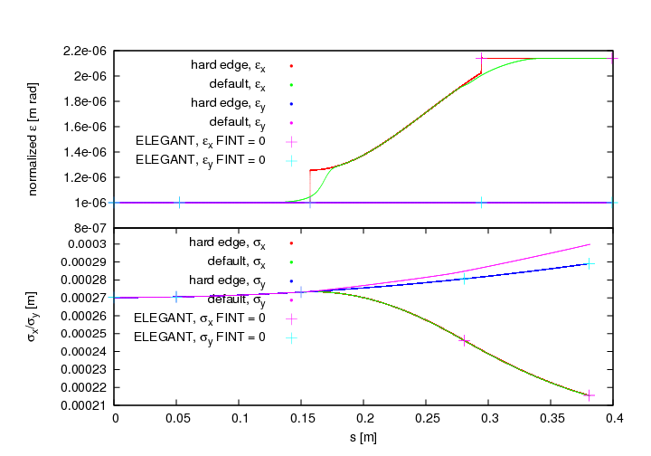{#fig-benchmarks-elegant-default width="70%"}

### Integration Time-Step Dependence

The appendix then studies the effect of integration time step and fringe-field
range. The main conclusion is that time-step size has the larger impact on the
accuracy.

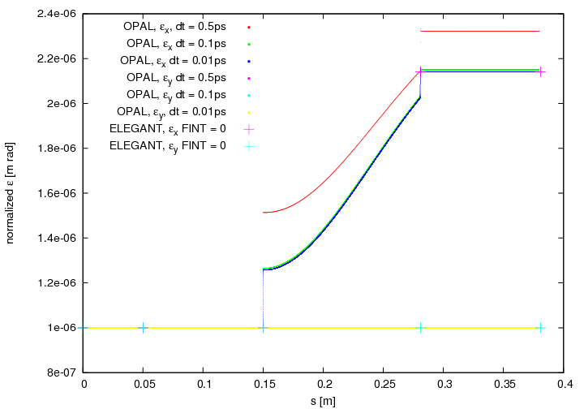{#fig-benchmarks-elegant-dt width="66%"}

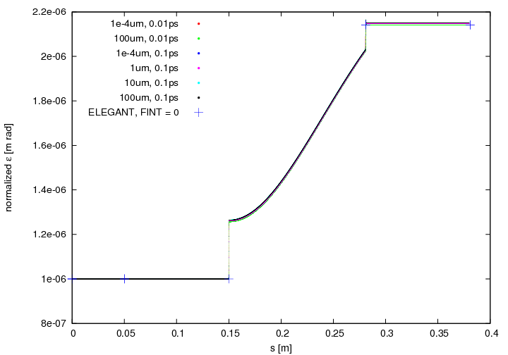{#fig-benchmarks-elegant-fringe width="66%"}

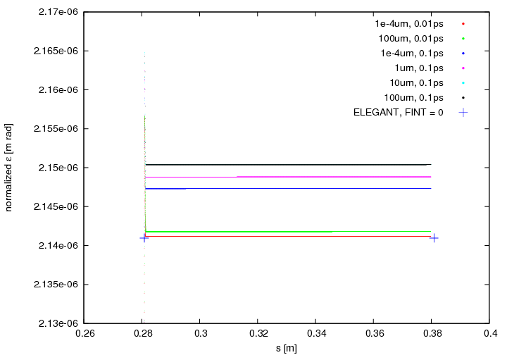{#fig-benchmarks-elegant-fringe-zoom width="66%"}

## 1D CSR Comparison with ELEGANT

The CSR benchmark uses an `SBEND` followed by a drift, both with
`WAKEF = FS_CSR_WAKE` enabled. For comparison with ELEGANT watch-point output,
the appendix converts the trace-space quantities by

$$
P_x = x'\,\beta\gamma,
\qquad
P_y = y'\,\beta\gamma,
\qquad
s = (\bar t - t)\,\beta c.
$$ {#eq-benchmarks-csr-trace-conversion}

The benchmark uses a simple line with `0.1 m` drift, `30 deg` bend, and
`0.4 m` drift. Without CSR, the codes agree closely; with CSR enabled, the
average momentum change and longitudinal emittance still agree well, while the
horizontal normalized emittance differs because `OPAL` and ELEGANT do not use
exactly the same fringe-field treatment and emittance definition.

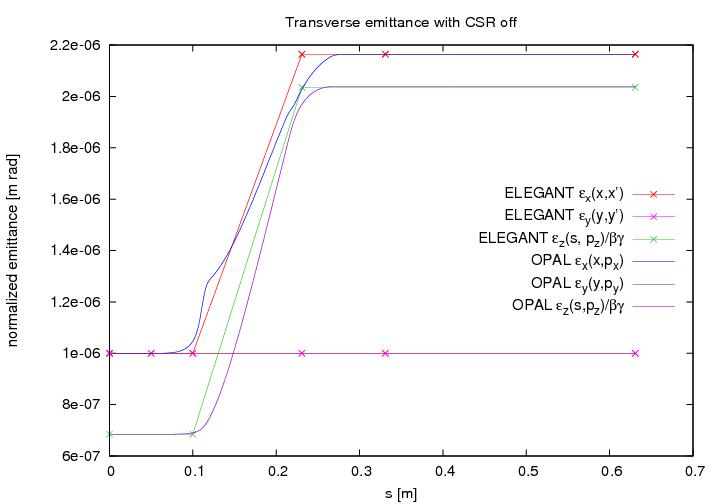{#fig-benchmarks-csr-off width="66%"}

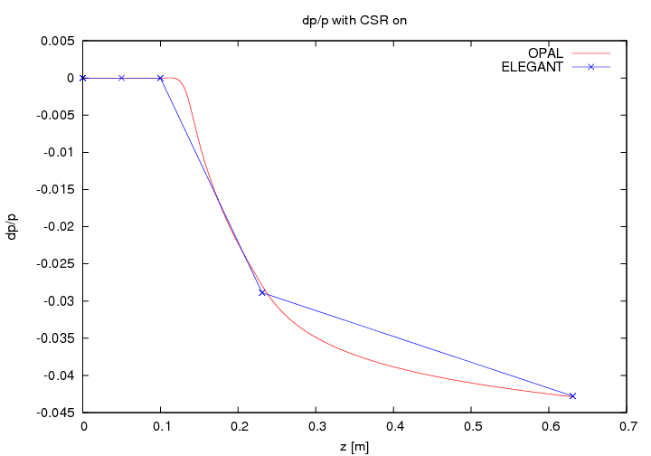{#fig-benchmarks-csr-dpp width="66%"}

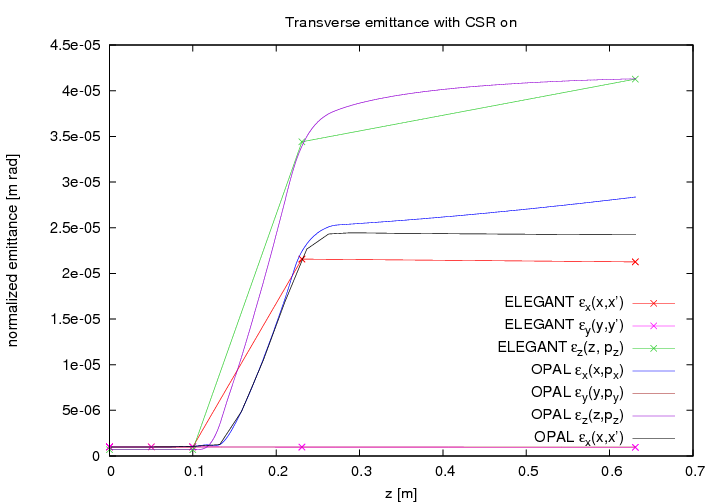{#fig-benchmarks-csr-on width="66%"}

One important detail from the original appendix is that the normalized
horizontal emittance in `OPAL` continues to grow in the downstream drift, while
the trace-like emittance does not. The source explains this as a real
correlation between transverse position and energy that is visible in
`\epsilon_x(x, P_x)` but not in `\epsilon_x(x, x')`.

## `OPAL` and `Impact-T`

The final benchmark family compares `OPAL` and `Impact-T` for a cold `10 mA`
`H+` bunch expanding in a `1 m` drift. The setup uses:

- Gaussian distribution cut at `4 sigma`
- `16^3` space-charge grid
- open boundary conditions
- `10^5` macro particles
- `1 MHz` bunch structure

### `OPAL` Input

```text
OPTION, ECHO = FALSE, PSDUMPFREQ = 10,
STATDUMPFREQ = 10, REPARTFREQ = 1000,
PSDUMPFRAME = GLOBAL, VERSION=10600;

TITLE, string="Gaussian bunch drift test";

REAL Edes    = 0.001;        // GeV
REAL CURRENT = 0.01;  // A

REAL gamma=(Edes+PMASS)/PMASS;
REAL beta=sqrt(1-(1/gamma^2));
REAL gambet=gamma*beta;
REAL P0 = gamma*beta*PMASS;

D1: DRIFT, ELEMEDGE = 0.0, L = 1.0;

L1: LINE = (D1);

Fs1: FIELDSOLVER, FSTYPE = FFT, MX = 16, MY = 16, MT = 16, BBOXINCR=0.1;

Dist1: DISTRIBUTION, TYPE = GAUSS,
       OFFSETX = 0.0, OFFSETY = 0.0, OFFSETZ = 15.0e-3,
       SIGMAX = 5.0e-3, SIGMAY = 5.0e-3, SIGMAZ = 5.0e-3,
       OFFSETPX = 0.0, OFFSETPY = 0.0, OFFSETPZ = 0.0,
       SIGMAPX = 0.0 , SIGMAPY = 0.0 , SIGMAPZ = 0.0 ,
       CORRX = 0.0, CORRY = 0.0, CORRZ = 0.0,
       CUTOFFX = 4.0, CUTOFFY = 4.0, CUTOFFLONG = 4.0;

Beam1: BEAM, PARTICLE = PROTON, CHARGE = 1.0, BFREQ = 1.0, PC = P0,
               NPART = 1E5, BCURRENT = CURRENT, FIELDSOLVER = Fs1;

SELECT, LINE = L1;

TRACK, LINE = L1, BEAM = Beam1, MAXSTEPS = 1000, ZSTOP = 1.0, DT = 1.0e-10;
 RUN, METHOD = "PARALLEL-T", BEAM = Beam1, FIELDSOLVER = Fs1, DISTRIBUTION = Dist1;
ENDTRACK;
STOP;
```

### `Impact-T` Input

```text
!Welcome to Impact-t input file.
!All comment lines start with "!" as the first character of the line.
! col row
1 1
!
! information needed by the integrator:
! step-size, number of steps, and number of bunches/bins (??)
!
!   dt    Ntstep  Nbunch
1.0e-10   700     1
!
! phase-space dimension, number of particles, a series of flags
! that set the type of integrator, error study, diagnostics, and
! image charge, and the cutoff distance for the image charge
!
! PSdim  Nptcl   integF  errF  diagF  imchgF  imgCutOff (m)
6 100000  1 0 1 0 0.016
!
! information about mesh: number of points in x, y, and z, type
! of boundary conditions, transverse aperture size (m),
! and longitudinal domain size (m)
!
!  Nx  Ny  Nz  bcF   Rx    Ry    Lz
16 16 16 1 0.15 0.15 1.0e5
!
!
! distribution type number (2 == Gauss), restart flag, space-charge substep
! flag, number of emission steps, and max emission time
!
! distType  restartF  substepF  Nemission  Temission
2           0         0         -1          0.0
!
!  sig*   sigp*  mu*p*  *scale  p*scale  xmu*      xmu*
!
0.005 0.0 0.0  1. 1. 0.0 0.0
0.005 0.0 0.0  1. 1. 0.0 0.0
0.005 0.0 0.0  1. 1. 0.0 0.0462
!
! information about the beam: current, kinetic energy, particle
! rest energy, particle charge, scale frequency, and initial cavity phase
!
! I/A   Ek/eV     Mc2/eV          Q/e  freq/Hz  phs/rad
0.010   1.0e6     938.271998e+06  1.0  1.0e6      0.0
!
!
! ======= machine description starts here =======
! the following lines, which must each be terminated with a '/',
! describe one beam-line element per line; the basic structure is
! element length, ???, ???, element type, and then a sequence of
! at most 24 numbers describing the element properties
!   0  drift tube    2      zedge radius
!   1  quadrupole    9      zedge, quad grad, fileID,
!                             radius, alignment error x, y
!                             rotation error x, y, z
! L/m  N/A N/A  type  location of starting edge  v1  <B0><B0><B0>  v23 /
1.0    0   0    0    0.0                           0.5            /
```

### Results

The appendix treats the agreement in the following plots as a consistency check
for the two space-charge implementations in a simple drift benchmark.

{#fig-benchmarks-impact width="100%"}

{#fig-benchmarks-impact-z width="50%"}

## References

- K. Crandall and D. Rusthoi, [_Documentation for TRACE: An Interactive
  Beam-Transport Code_](https://doi.org/10.2172/5937743), Los Alamos report
  LA-10235-MS (1985).
- K. L. Brown et al., [_TRANSPORT - A Computer Program for Designing Charged
  Particle Beam Transport Systems_](http://cds.cern.ch/record/133647), CERN
  80-4 (1980).
- U. Rohrer, [PSI graphic transport framework](http://aea.web.psi.ch/Urs_Rohrer/MyWeb/trans.htm).
- M. Borland, [_elegant: a flexible SDDS-compliant code for accelerator
  simulation_](https://publications.anl.gov/anlpubs/2000/08/36940.pdf), LS-287
  (2000).
- L. Qiang et al., `Impact-T` references as cited in the original appendix.
:::::
