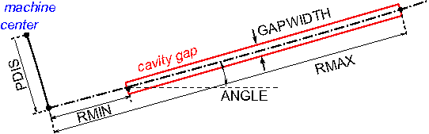
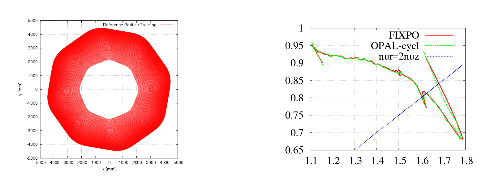
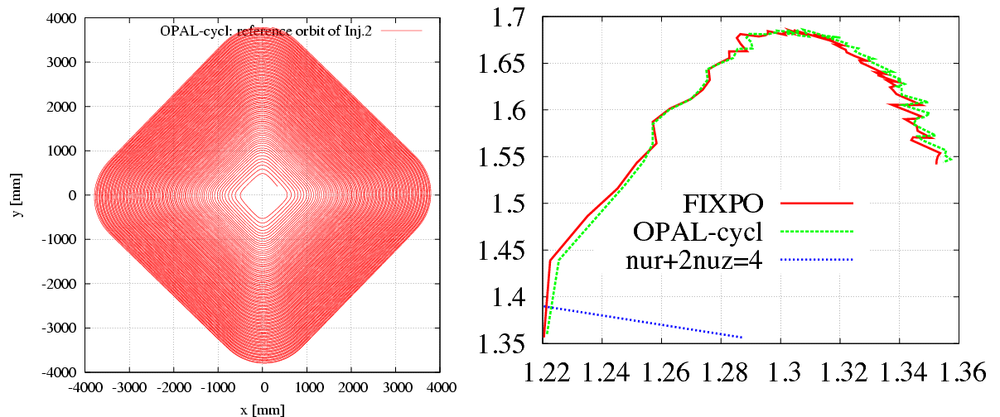

```{=html}
<div class="feature-toggle">
  <span>View:</span>
  <label class="feature-choice"><input type="radio" name="feature-mode" value="opal"> OPAL</label>
  <label class="feature-choice"><input type="radio" name="feature-mode" value="opalx"> OPALX</label>
  <label class="feature-choice"><input type="radio" name="feature-mode" value="both" checked> Both</label>
</div>
```

:::: {.feature-opal}
## Introduction

`OPAL-CYCL` is the cyclotron and FFA flavor of OPAL. It uses time as the
independent variable and supports single-particle, tune, and multiparticle
tracking in ring-like machines. The legacy manual positions it as the branch for
sector cyclotrons, FFAs, and ring studies with acceleration, space charge, and
multi-bunch effects.

## Tracking Modes

### Single Particle Tracking Mode

This mode follows one reference particle through the cyclotron fields and is
primarily used for orbit studies, closed-orbit checks, and setup work.

### Tune Calculation Mode

This mode evaluates the transverse tunes around the closed orbit.

### Multi-particle Tracking Mode

This is the production mode for bunch tracking with space charge and
acceleration.

## Variables in `OPAL-CYCL`

The cyclotron flavor uses cylindrical and local reference-frame variables,
together with specialized initial-distribution conventions. The initial bunch is
specified in the local frame attached to the reference trajectory rather than
directly in the global cylindrical frame.

## Field Maps

`OPAL-CYCL` supports several cyclotron-specific median-plane and RF map formats.
The field reader is selected by the `TYPE` parameter of the `CYCLOTRON`
element.

### `CARBONCYCL` Type

If `TYPE = CARBONCYCL`, the code reads median-plane `B_z` data in the ordering
shown below, with primary direction in azimuth and secondary direction in
radius.

{#fig-opalcycl-carbon-field width="30%"}

The source format is a plain `B_z` table preceded by six header parameters:

- `r_min [mm]`
- `Delta r [mm]`
- `theta_min [deg]`
- `Delta theta [deg]`
- `N_theta`
- `N_r`

If `Delta r` or `Delta theta` is fractional, the source format allows the
negative reciprocal convention used in the legacy manual. For example,
`Delta theta = 1/3 deg` is represented by `-3.0`.

Example:

```text
3.0e+03
10.0
0.0
-3.0
300
161
1.414e-03  3.743e-03  8.517e-03  1.221e-02  2.296e-02
3.884e-02  5.999e-02  8.580e-02  1.150e-01  1.461e-01
...
```

The number of values per line is arbitrary.

### `CYCIAE` Type

If `TYPE = CYCIAE`, the program reads a median-plane field extracted from an
ANSYS workflow. The original manual includes the APDL post-processing script
used to dump the field:

```text
/post1
resume,solu,db
csys,1
nsel,s,loc,x,0
nsel,r,loc,y,0
nsel,r,loc,z,0
PRNSOL,B,COMP

CSYS,1
rsys,1

*do,count,0,200
   path,cyc100_Ansys,2,5,45
   ppath,1,,0.01*count,0,,1
   ppath,2,,0.01*count/sqrt(2),0.01*count/sqrt(2),,1

   pdef,bz,b,z
   paget,data,table
   ...
*enddo
finish
```

As with `CARBONCYCL`, the generated file must be prefixed with the six header
parameters `r_min`, `Delta r`, `theta_min`, `Delta theta`, `N_theta`, and
`N_r`.

### `BANDRF` Type

`BANDRF` allows both magnetic and electric fields to be supplied through the
`CYCLOTRON` element. The magnetic field uses the same median-plane layout as
`CARBONCYCL`. The electric field comes from one or more H5Hut/H5Part blocks
generated by the `ascii2h5block` conversion tool. This is the path used for
central-region RF models with more complicated three-dimensional geometry.

### `RING` Type

If `TYPE = RING`, the program accepts the PSI-style measured field format used
for files such as `ZYKL9Z.NAR` and `SO3AV.NAR`. Four extra header parameters are
prepended:

- `r_min [mm]`
- `Delta r [mm]`
- `theta_min [deg]`
- `Delta theta [deg]`

Example:

```text
1900.0
20.0
0.0
-3.0
 LABEL=S03AV
 CFELD=FIELD     NREC=  141      NPAR=    3
 ...
```

### 3D Field Map

It is also possible to load full 3D field maps for cyclotron tracking. In this
mode the line is assembled from `RINGDEFINITION` plus one or more `SBEND3D`
elements, similar to the way `OPAL-T` uses placed field elements.

```text
ringdef: RINGDEFINITION, HARMONIC_NUMBER=6, LAT_RINIT=2350.0, LAT_PHIINIT=0.0,
         LAT_THETAINIT=0.0, BEAM_PHIINIT=0.0, BEAM_PRINIT=0.0,
         BEAM_RINIT=2266.0, SYMMETRY=4.0, RFFREQ=0.2;

triplet: SBEND3D, FMAPFN="fdf-tosca-field-map.table", LENGTH_UNITS=10., FIELD_UNITS=-1e-4;

l1: Line = (ringdef, triplet, triplet);
```

The field file itself stores Cartesian positions and fields, while the user
supplies `LENGTH_UNITS` and `FIELD_UNITS` explicitly. The legacy manual notes
that RF cavities are not combined with this mode.

### User’s Own Field Map

If none of the built-in readers matches the available data, the source manual
explicitly points users to the cyclotron field-read functions as the extension
point for custom formats.

## RF Field

### Read RF Voltage Profile

Cyclotron cavities can be modeled as infinitely thin gaps with transit-time
correction. The two-gap cavity is treated as two single gaps, while the spiral
gap cavity was marked as not implemented in the legacy manual.

The gap-voltage profile is read from ASCII:

```text
6
0.00      0.15      2.40
0.20      0.65      2.41
0.40      0.98      0.66
0.60      0.88     -1.59
0.80      0.43     -2.65
1.00     -0.05     -1.71
```

The first line gives the number of sample points. The remaining columns are
normalized gap position, normalized voltage, and derivative.

### Read 3D RF Field Map

For `TYPE = BANDRF`, the RF field is read from H5Hut/H5Part files produced by
`ascii2h5block`. The original manual documents the conversion command as

```text
ascii2h5block efield.txt hfield.txt ehfout
```

The ASCII inputs begin with grid dimensions, followed by Cartesian coordinates
and field components:

```text
101 101 11
-0.110000   -0.018000   -0.006000   37.341814   226.620820    -319049.189111
-0.109200   -0.018000   -0.006000   56.839707   209.995240     303511.031113
...
```

{#fig-opalcycl-cavity width="45%"}

## Particle Tracking and Acceleration

`OPAL-CYCL` uses fourth-order Runge-Kutta and second-order Leap-Frog tracking
schemes. In the Runge-Kutta path the external magnetic field is evaluated four
times per step. For an arbitrary off-plane point the code first interpolates
the median-plane `B_z` value and then expands the field away from the median
plane.

When a particle crosses an RF cavity during a step, the step is split:

1. track to the crossing time,
2. apply the cavity voltage kick and refresh `beta` and `gamma`,
3. track the remaining substep.

## Space Charge

`OPAL-CYCL` uses the same solver family as `OPAL-T`; see the `Field Solver`
chapter. The usual mode is one space-charge evaluation per time step. The
legacy manual also documents an experimental multiple-time-stepping variant that
reuses the space-charge solution every `N`th step.

## Multi-bunch Mode

The neighboring-bunch model addresses the case where radial turn separation is
comparable to bunch size, so inter-bunch space-charge effects matter. The
manual describes two working modes:

- `AUTO`: start with a single bunch and inject neighboring bunches only when
  their effect becomes important
- `FORCE`: start multi-bunch tracking from injection

For multi-bunch space charge, particles are grouped into energy bins. Each bin
is Lorentz transformed separately, solved separately, and transformed back so
that large inter-turn energy differences do not invalidate the rest-frame
approximation.

## Input

All three `OPAL-CYCL` modes use standard MAD-like input files. Tune
calculations require an additional SEO file with rows of

```text
E[MeV]   r[mm]   P_r[mrad]
```

Example:

```text
72.000 2131.4   -0.240
74.000 2155.1   -0.296
76.000 2179.7   -0.319
...
```

The legacy manual also points to a helper script:

- [tuning.sh](examples/tuning.sh)

## Output

`OPAL-CYCL` writes the usual diagnostics plus mode-specific orbit, tune, and
field products.

### Statistics Output

The `.stat` file follows the `OPAL-T` convention but changes the cyclotron
coordinate meaning:

- `z`/`s` refers to the vertical direction
- `y` corresponds to the longitudinal or beam-travel direction

Additional cyclotron-specific columns include:

| Name | Units | Meaning |
|---|---|---|
| `R0_x`, `R0_y`, `R0_s` | `m` | position of particle ID 0 in serial runs |
| `P0_x`, `P0_y`, `P0_s` | `1` | momentum of particle ID 0 in serial runs |
| `halo_x`, `halo_y`, `halo_z` | `1` | halo diagnostics |
| `azimuth` | `deg` | azimuth in global coordinates |

### Single Particle Tracking Output

The code writes orbit and turn-by-turn ASCII diagnostics such as:

- `<input>-trackOrbit.dat`
- `<input>-afterEachTurn.dat`
- `<input>-Angle0.dat`
- `<input>-Angle1.dat`
- `<input>-Angle2.dat`

### Tune Calculation Output

The tune results are written to `tuningresult`.

### Multi-particle Tracking Output

The bunch output is written to H5Hut/HDF5 and can be analyzed with H5root and
related post-processing tools. Central-particle orbit diagnostics are also
written in ASCII.

### Field Maps

Median-plane maps can be dumped to `gnu.out`. For `CARBONCYCL` and `BANDRF`,
the file `eb.out` stores position, electric field, and magnetic field vectors.
`DUMPFIELDS` and `DUMPEMFIELDS` can be used to write the external field on a
different sampling grid than the original input map.

{#fig-opalcycl-reference-orbit width="48%"}

{#fig-opalcycl-orbit-tune width="62%"}

## Matched Distribution

For matched-distribution studies the user must define a periodic accelerator,
its symmetry, and a field map. The distribution is then requested with
`TYPE = GAUSSMATCHED` and normalized emittances:

```text
/*
 * specify periodic accelerator
 */
l1 = ...

/*
 * try finding a matched distribution
 */
Dist1:DISTRIBUTION, TYPE=GAUSSMATCHED, LINE=l1, FMAPFN=...,
                    MAGSYM=..., EX = ..., EY = ..., ET = ...;
```

### Example

The reference example in the original manual is the PSI Ring Cyclotron at
`580 MeV` and `2.2 mA`. The matched-distribution algorithm computes the
covariance matrix in `(x, x', y, y', z, delta)`, while particles are later
represented in `(x, p_x, y, p_y, z, p_z)`, so the appropriate transformation is
required before comparing rms emittances.

Source links preserved from the original manual:

- [matchedDistribution.in](https://github.com/OPALX-project/regression-tests/blob/master/RegressionTests/RingCyclotronMatched/RingCyclotronMatched.in)
- [matched distribution regression test directory](https://github.com/OPALX-project/regression-tests/tree/master/RegressionTests/RingCyclotronMatched)
- [matchedDistribution.output](https://github.com/OPALX-project/regression-tests/blob/master/RegressionTests/RingCyclotronMatched/reference/RingCyclotronMatched.out)

## References

- M. M. Gordon and V. Taivassalo, [_Nonlinear Effects of Focusing Bars Used in
  the Extraction Systems of Superconducting Cyclotrons_](https://ieeexplore.ieee.org/document/4333942),
  IEEE Trans. Nucl. Sci. 32, 2447 (1985).
- M. Howison et al., [_H5hut: A High-Performance I/O Library for Particle-based
  Simulations_](http://dx.doi.org/10.1109/CLUSTERWKSP.2010.5613098), IEEE Cluster
  Workshops (2010).
- [H5root: a ROOT Based Graphical User Interface for H5hut](h5root.html)
- T. Schietinger, [_H5PartROOT - A visualization and post-processing tool for
  accelerator simulations_](https://accelconf.web.cern.ch/ICAP2009/papers/thpsc049.pdf).
::::
