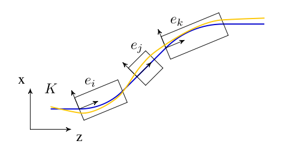
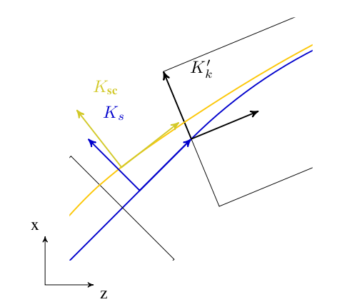
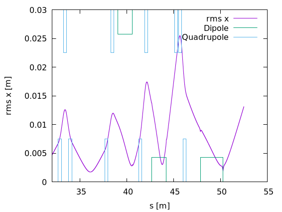

```{=html}
<div class="feature-toggle">
  <span>View:</span>
  <label class="feature-choice">
    <input type="radio" name="feature-mode" value="opal"> OPAL
  </label>
  <label class="feature-choice">
    <input type="radio" name="feature-mode" value="opalx"> OPALX
  </label>
  <label class="feature-choice">
    <input type="radio" name="feature-mode" value="both" checked> Both
  </label>
</div>
```

:::: {.feature-opal}
## Introduction

`OPAL-T` is the beam-line and linac flavor of OPAL. It is a fully
three-dimensional time-domain tracking code for relativistic particles, with
self-consistent space charge in the electrostatic approximation, wake-field
support, and a broad element model that allows overlapping external fields. The
legacy manual positions `OPAL-T` as one of the few production codes built from
the start around parallel execution for high-statistics start-to-end
simulations.

## Variables in `OPAL-T`

The canonical variables are:

| Variable | Meaning | Units |
|---|---|---|
| `X` | horizontal position relative to the element axis | `m` |
| `PX` | horizontal normalized canonical momentum `beta_x gamma` | `1` |
| `Y` | vertical position relative to the element axis | `m` |
| `PY` | vertical normalized canonical momentum `beta_y gamma` | `1` |
| `Z` | longitudinal position in floor coordinates | `m` |
| `PZ` | longitudinal normalized canonical momentum `beta_z gamma` | `1` |

The independent variable is time `t [s]`.

## Integration of the Equation of Motion

`OPAL-T` integrates the relativistic Lorentz equation

$$
\frac{d(\gamma \mathbf v)}{dt} =
\frac{q}{m}
\left[
\mathbf E_{\mathrm{ext}} + \mathbf E_{\mathrm{sc}} +
\mathbf v \times (\mathbf B_{\mathrm{ext}} + \mathbf B_{\mathrm{sc}})
\right].
$$ {#eq-opalt-lorentz}

The legacy implementation uses the Boris-Buneman algorithm for the particle
update. In practice a time step consists of:

1. locating the active region of the reference particle,
2. assembling coordinate transforms between the reference frame, floor frame,
   and element-local frames,
3. evaluating external fields and self-fields,
4. pushing the particles and reference particle forward,
5. updating diagnostics and output.

## Positioning of Elements

Since OPAL 2.0, elements can be placed directly in space using `X`, `Y`, `Z`,
`THETA`, `PHI`, and `PSI`. The older `ELEMEDGE` notation is still supported.
In that legacy path `OPAL-T` reconstructs the 3D position from `ELEMEDGE`,
`ANGLE`, and `DESIGNENERGY`, assuming a reference trajectory built from straight
segments and circular arcs without fringe-field corrections.

For simple migration, `OPAL-T` writes a `3D.opal` file in which the inferred
placements are made explicit. Beamlines containing guns should be supplemented
with the element `SOURCE` so the code can adjust the initial reference-particle
energy correctly.

## Coordinate Systems

The motion of the bunch is described relative to several coordinate systems.
Because `OPAL-T` uses time as independent variable, the relation to a
path-length derivative is

$$
\frac{d}{dt} = \beta c \frac{d}{ds}.
$$ {#eq-opalt-time-to-s}

### Global Cartesian Coordinate System

The floor coordinate system `K` is the laboratory frame in which the placed
beamline is embedded.

{#fig-opalt-coords width="50%"}

### Local Cartesian Coordinate System

Each element `e_i` carries a local frame `K'_i` whose origin is at the entrance
of the element. The displacement is described by a vector `v` and the
orientation by a unitary matrix `W`. The source manual writes this as a product
of Tait-Bryan rotations:

$$
\mathbf v =
\begin{pmatrix}
X \\ Y \\ Z
\end{pmatrix},
\qquad
\mathcal W = \mathcal S \mathcal T \mathcal U,
$$ {#eq-opalt-local-displacement}

with pitch `Theta`, yaw `Phi`, and roll `Psi`.

The element-by-element recurrence is

$$
\mathbf v_i = \mathcal W_{i-1}\mathbf r_i + \mathbf v_{i-1},
\qquad
\mathcal W_i = \mathcal W_{i-1}\mathcal S_i.
$$ {#eq-opalt-placement-recurrence}

### Space-Charge Coordinate System

For the electrostatic space-charge solve, `OPAL-T` introduces a co-moving frame
whose origin is at the bunch mean position and whose `z` axis is aligned with
the mean momentum.

### Curvilinear Coordinate System

For beam statistics and reference-orbit interpretation, `OPAL-T` uses a local
curvilinear frame `(x, y, s)` attached to the reference trajectory.

{#fig-opalt-curvcoords width="50%"}

### Design or Reference Orbit

The reference orbit consists of straight sections and circular arcs and is
computed by the Orbit Threader from the placed elements.

### Compatibility Mode

The compatibility mode was introduced so existing input files could remain valid
while the geometry model moved to explicit 3D placement. The user can choose
whether downstream `ELEMEDGE` positions should include fringe-field effects with
the `IDEALIZED` option. The manual warns that this approximation is weakest for
elements overlapping dipole fringe regions.

### Orbit Threader and Autophasing

The `OrbitThreader` integrates a design particle through the lattice and builds
the `IndexMap` structure used to accelerate active-element lookup during bunch
tracking. When the reference particle reaches an RF structure for the first
time, the legacy implementation also autophases it.

## Flow Diagram of `OPAL-T`

{#fig-opalt-flow width="70%"}

A regular time step joins the transformation from the reference frame to the
local element frames through the floor frame. The legacy manual notes that the
rotations entering these transformations are accumulated with quaternions before
conversion to matrix form for the actual particle rotation.

## Output

In addition to progress information on standard output, `OPAL-T` writes several
families of files.

### Statistics Output

The `<input>.stat` file stores bunch moments and diagnostics in ASCII SDDS
style. The dump rate is controlled by `STATDUMPFREQ`.

The original manual lists a long table. The most important columns are:

| Column | Name | Units | Meaning |
|---:|---|---|---|
| 1 | `t` | `ns` | time |
| 2 | `s` | `m` | path length |
| 3 | `numParticles` | `1` | number of macroparticles |
| 4 | `charge` | `C` | bunch charge |
| 5 | `energy` | `MeV` | mean bunch energy |
| 6-8 | `rms_x`, `rms_y`, `rms_s` | `m` | rms bunch size |
| 12-14 | `emit_x`, `emit_y`, `emit_s` | `mrad` | normalized emittance |
| 18-23 | `ref_x ... ref_pz` | mixed | reference-particle phase space in floor coordinates |
| 34-39 | `Bx_ref ... Ez_ref` | field units | fields at the reference particle |

The later columns in the source table also include:

- `dE`: bunch energy spread
- `dt`: time-step size
- `partsOutside`: particles outside the beam-halo boundary
- `DebyeLength`
- `plasmaParameter`
- `temperature`
- `rmsDensity`

Two options extend this base payload:

- `COMPUTEPERCENTILES`
- `DUMPBEAMMATRIX`

With `COMPUTEPERCENTILES = TRUE`, the file gains percentile columns for the
beam size and the normalized emittance at `68.27%`, `95.45%`, `99.73%`, and
`99.994%` in each of `x`, `y`, and `z`.

With `DUMPBEAMMATRIX = TRUE`, the file gains the upper-triangular entries of
the six-dimensional beam matrix: `S11`, `S12`, ..., `S16`, `S22`, ..., `S66`.

### Monitor Statistics Output

Monitor elements write a dedicated second statistics file,
`data/<input>_Monitors.stat`, each time the bunch crosses a monitor. The source
chapter documents the payload as:

| Column | Name | Units | Meaning |
|---:|---|---|---|
| 1 | `name` | string | monitor name |
| 2 | `s` | `m` | path-length position |
| 3 | `t` | `ns` | time at which the reference particle passes |
| 4 | `numParticles` | `1` | number of macroparticles |
| 5-7 | `rms_x`, `rms_y`, `rms_s` | `m` | rms beam size |
| 8 | `rms_t` | `ns` | rms passage-time spread |
| 9-11 | `rms_px`, `rms_py`, `rms_ps` | `1` | rms momenta |
| 12-14 | `emit_x`, `emit_y`, `emit_s` | `mrad` | normalized emittance |
| 15-18 | `mean_x`, `mean_y`, `mean_s`, `mean_t` | mixed | mean bunch coordinates at the monitor |
| 19-24 | `ref_x ... ref_pz` | mixed | reference-particle phase space in floor coordinates |
| 25-27 | `max_x`, `max_y`, `max_s` | `m` | maximum beam size |
| 28-30 | correlations | `1` | `xpx`, `ypy`, `zpz` |

### Input File Transcription

`OPAL-T` writes `data/<input>_3D.opal`. This is a transcription of the input
file in which `ELEMEDGE` placements are replaced by the corresponding explicit
`X`, `Y`, `Z`, `THETA`, `PHI`, and `PSI` values computed by the geometry layer.

### Element Positions Output Files

`OPAL-T` can dump placed element geometry in several formats:

- `data/<input>_ElementPositions.txt`
- `data/<input>_ElementPositions.py`
- `data/<input>_ElementPositions.sdds`

These are intended for visualization and placement cross-checking.

{#fig-opalt-element-indicator width="48%"}

The source manual distinguishes the three outputs:

- `ElementPositions.txt`
  Stores `BEGIN`, `MID`, and `END` entries for elements. The remaining columns
  contain the floor-coordinate position in the order `z`, `x`, `y`.
- `ElementPositions.py`
  A Python helper script for exporting the beamline to ASCII, VTK, or HTML. It
  supports `--export-vtk`, `--export-web`, projection to a plane, and explicit
  projection normals.
- `ElementPositions.sdds`
  An SDDS-style indicator file used to overlay element locations on beam
  statistics plots.

For the SDDS indicator file the documented columns are:

| Column | Name | Meaning |
|---:|---|---|
| 1 | `s` | path-length position |
| 2 | `dipole` | dipole present flag |
| 3 | `quadrupole` | quadrupole present flag |
| 4 | `sextupole` | sextupole present flag |
| 5 | `octupole` | octupole present flag |
| 6 | `decapole` | decapole present flag |
| 7 | `multipole` | general multipole present flag |
| 8 | `solenoid` | solenoid present flag |
| 9 | `rfcavity` | cavity present flag |
| 10 | `monitor` | monitor present flag |
| 11 | `element_names` | element names present at that location |

### Reference Particle Trajectory Output

The reference-particle path is written to
`data/<input>_DesignPath.dat`. The documented columns are:

| Column | Meaning |
|---:|---|
| 1 | path-length position |
| 2-4 | floor-coordinate position `(x, y, z)` |
| 5-7 | floor-coordinate normalized momentum `(p_x, p_y, p_z)` |
| 8-10 | electric field `(E_x, E_y, E_z)` |
| 11-13 | magnetic field `(B_x, B_y, B_z)` |
| 14 | kinetic energy |
| 15 | time |

## Multiple Species

The legacy manual notes support for workflows with more than one species or beam
component sharing the same beamline. The exact setup depends on the beam and
tracking commands and is one of the areas where the OPALX path diverges from
the older `OPAL-T` control model.

## Multipoles in Different Coordinate Systems

The last third of the source chapter is dedicated to the multipole fringe-field
models. Multipole body fields and fringe fields must be interpreted in the
local chart associated with the element:

- straight multipoles use the local Cartesian frame,
- curved multipoles use the curvilinear frame tied to the reference path.

The practical consequence is that the same nominal multipole coefficients can
lead to different field support and geometric interpretation depending on the
element class and fringe model.

### Fringe Field Models

The straight-multipole derivation starts from Maxwell’s equations,

$$
\nabla \cdot \mathbf{B} = 0,
\qquad
\nabla \times \mathbf{B} = 0,
$$ {#eq-opalt-maxwell-start}

and a complex-potential representation. In cylindrical coordinates, this yields
the standard multipole expansion

$$
\begin{aligned}
B_{\varphi}(r,\varphi) &= B_0 \sum_{n=1}^{\infty}
\left( b_n \cos n\varphi + a_n \sin n\varphi \right)
\left(\frac{r}{r_0}\right)^{n-1}, \\
B_r(r,\varphi) &= B_0 \sum_{n=1}^{\infty}
\left( -a_n \cos n\varphi + b_n \sin n\varphi \right)
\left(\frac{r}{r_0}\right)^{n-1}.
\end{aligned}
$$ {#eq-opalt-multipole-expansion}

where `b_n` and `a_n` are the normal and skew coefficients at reference radius
`r_0`.

For a straight fringe field, the source chapter expands the scalar potential as

$$
V = \sum_{n=1}^{\infty} V_n(r,z)\sin n\varphi,
\qquad
V_n = \sum_{k=0}^{\infty} C_{n,k}(z)\,r^{n+2k},
$$ {#eq-opalt-straight-potential}

and derives the recurrence

$$
C_{n,k}(z) =
- \frac{1}{4k(n+k)} \frac{d^2 C_{n,k-1}}{dz^2},
\qquad k = 1,2,\ldots
$$ {#eq-opalt-straight-recurrence}

with closed form

$$
C_{n,k}(z) = (-1)^k \frac{n!}{2^{2k} k! (n+k)!}
\frac{d^{2k} C_{n,0}(z)}{dz^{2k}}.
$$ {#eq-opalt-straight-closed}

The central-axis gradient profile `C_{n,0}(z)` is then modeled with an Enge
function.

### Fringe Field of a Curved Multipole

For a curved multipole with fixed curvature radius `rho`, the Frenet-Serret
scale factor is

$$
h_s = 1 + \frac{x}{\rho}.
$$ {#eq-opalt-hs}

The source expands the three field components as

$$
\begin{aligned}
B_z &= \sum_{i,k=0}^{\infty} b_{i,k} x^i z^{2k}, \\
B_x &= z \sum_{i,k=0}^{\infty} a_{i,k} x^i z^{2k}, \\
B_s &= z \sum_{i,k=0}^{\infty} c_{i,k} x^i z^{2k},
\end{aligned}
$$ {#eq-opalt-curved-general}

and derives recursion relations from Maxwell’s equations, including

$$
a_{i,k} = \frac{i+1}{2k+1} b_{i+1,k},
$$ {#eq-opalt-a-factors}

and

$$
c_{i,k} + \frac{1}{\rho} c_{i-1,k}
= \frac{1}{2k+1}\,\partial_s b_{i,k}.
$$ {#eq-opalt-c-factors}

The remaining coefficients can then be determined recursively from the mid-plane
field series

$$
B_z(z=0) = B_{0,0} + B_{1,0}x + B_{2,0}x^2 + \cdots.
$$ {#eq-opalt-midplane-series}

The variable-curvature extension `rho = rho(s)` is then obtained by carrying an
additional `\partial_s rho` term through the same expansion strategy.

### A More Compact Fringe-Field Treatment

The source closes with an alternative derivation based on the factorized
mid-plane field

$$
B_z(x,z=0,s) = T(x)\,S(s),
$$ {#eq-opalt-compact-midplane}

and an odd-in-`z` scalar potential

$$
\psi = z f_0(x,s) + \frac{z^3}{3!} f_1(x,s) + \frac{z^5}{5!} f_2(x,s) + \cdots.
$$ {#eq-opalt-compact-potential}

For a straight multipole, Laplace’s equation leads to

$$
f_{n+1}(x,s) = -(\partial_x^2 + \partial_s^2)\,f_n(x,s),
$$ {#eq-opalt-compact-straight}

while for curved multipoles the operator is modified by the curvature terms
through `h_s`. The point of this alternative derivation is to keep the geometry
and fringe profile separated through `T(x)` and `S(s)`.

::::
