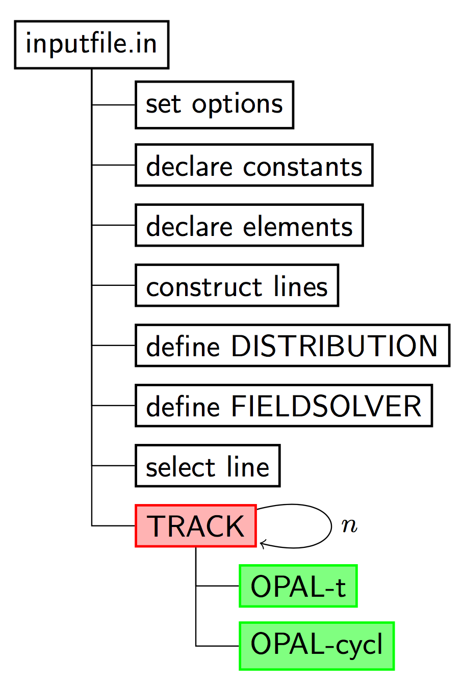
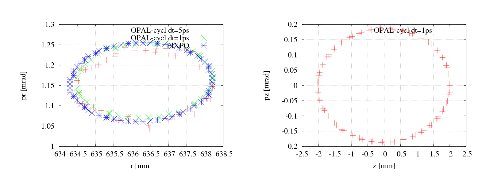
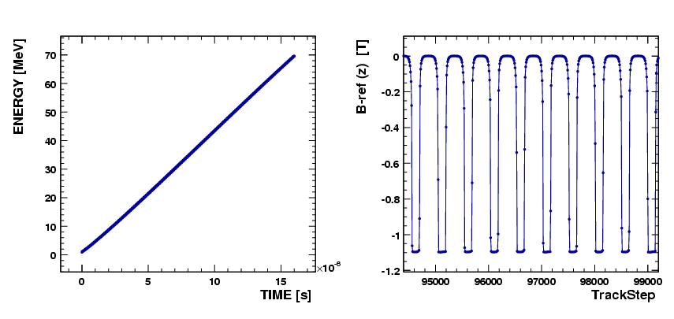
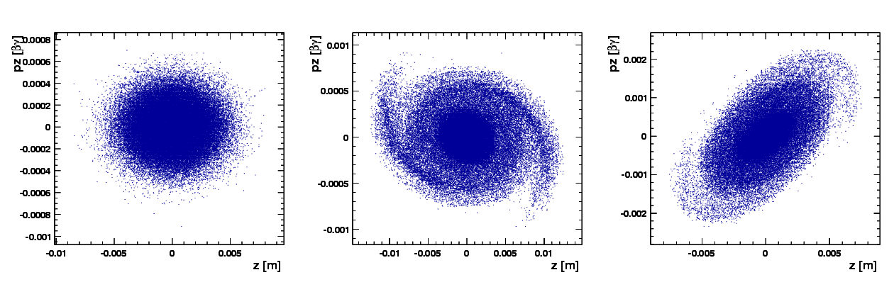

```{=html}
<div class="feature-toggle">
  <span>View:</span>
  <label class="feature-choice">
    <input type="radio" name="feature-mode" value="opal"> OPAL
  </label>
  <label class="feature-choice">
    <input type="radio" name="feature-mode" value="opalx"> OPALX
  </label>
  <label class="feature-choice">
    <input type="radio" name="feature-mode" value="both" checked> Both
  </label>
</div>
```

::: {.feature-opal}
This chapter provides a jump start for some of the most commonly used OPAL
features. The complete set of examples is still broader than this pilot, but
the examples below are representative and can be run with modest computing
resources. Most run on a single core, and several can still be used efficiently
 on a small number of cores.
:::

::: {.feature-opal}
## The Simulation Cycle

{#fig-simulation-cycle width="30%"}
:::

::: {.feature-opal}
## Starting OPAL

The application name is `opal`. When called without any argument, an
interactive session is started.

```text
$ opal
Ippl> CommMPI: Parent process waiting for children ...
Ippl> CommMPI: Initialization complete.
>                ____  _____       ___
>               / __ \|  __ \ /\   | |
>              | |  | | |__) /  \  | |
>              | |  | |  ___/ /\ \ | |
>              | |__| | |  / ____ \| |____
>               \____/|_| /_/    \_\______|
OPAL >
OPAL > This is OPAL (Object Oriented Parallel Accelerator Library) Version 2.0.0 ...
OPAL >
OPAL > Please send cookies, goodies or other motivations (wine and beer ... )
OPAL > to the OPAL developers opal@lists.psi.ch
OPAL >
OPAL > Time: 16.43.23 date: 30/05/2017
OPAL > Reading startup file "/Users/adelmann/init.opal".
OPAL > Finished reading startup file.
==>
```

One can exit from this session with the command `QUIT;`.

For batch runs, OPAL accepts the command line arguments shown below.

| Argument | Values | Function |
|---|---|---|
| `--input` | `<file>` | The input file. Using `--input` is optional; the input file can also be provided as first or last argument. |
| `--info` | `0` to `5` | Controls the amount of output to the command line. Default: `1`. |
| `--warn` | `0` to `5` | Controls the amount of warning output. Default: `1`. |
| `--restart` | `-1` to `<integer>` | Restart from the given step in a saved phase-space file. |
| `--restartfn` | `<file>` | A file in H5hut format from which OPAL should restart. |
| `--help` |  | Display a summary of all command-line arguments and quit. |
| `--help-command` | `<command>` | Display help for the specified OPAL command. |
| `--version` |  | Print the installed OPAL version. |
| `--version-full` |  | Print the OPAL version with additional information. |
| `--git-revision` |  | Print the repository revision hash. |
| `--summary` |  | Print the IPPL library summary at start. |
| `--time` |  | Show total time used in execution. |
| `--notime` |  | Do not show timing info. |
| `--commlib <x>` | `mpi` or `serial` | Select the parallel communication library. |

Example:

```sh
opal input.in --restartfn input.h5 --restart -1 --info 3
```
:::

::: {.feature-opal}
## Auto-phase Example

This is a partially complete example. First, OPAL must be set into
`AUTOPHASE` mode, and the nominal phase can for example be set to
$-3.5^{\circ}$.

```text
Option, AUTOPHASE=4;

REAL FINSS_RGUN_phi= (-3.5/180*Pi);
```

The cavity could then be defined as:

```text
FINSS_RGUN: RFCavity, L = 0.17493, VOLT = 100.0,
    FMAPFN = "FINSS-RGUN.dat",
    ELEMEDGE = 0.0, TYPE = STANDING, FREQ = 2998.0,
    LAG = FINSS_RGUN_phi;
```

with `FINSS_RGUN_phi` defining the off-crest phase. A normal `TRACK` command
can then be executed. A file containing the values of maximum phases is
created, with a format like:

```text
1
FINSS_RGUN
2.22793
```

The first entry defines the number of cavities in the simulation.
:::

::: {.feature-opal}
## Examples of Particle Accelerators and Beamlines

### Laser Emission, OBLA (SwissFEL Test Facility) 4 MeV Gun and Beamline

The input deck is:

- <https://github.com/OPALX-project/regression-tests/blob/master/RegressionTests/LaserEmission-1/LaserEmission-1.in>

Supplementary files are available in:

- <https://github.com/OPALX-project/regression-tests/tree/master/RegressionTests/LaserEmission-1>

### PSI Injector II Cyclotron

Injector II is a separated-sector cyclotron specially designed for
pre-acceleration of high-intensity proton beams for the PSI Ring cyclotron. It
has four sector magnets, two double-gap acceleration cavities (represented here
by two single-gap cavities), and two single-gap flat-top cavities.

The input file for single-particle tracking is:

- [Injector2.in](examples/Injector2.in)

The supplementary files should be placed in the same directory:

- [Cav1.dat](examples/Fieldmaps/Cav1.dat)
- [Cav3.dat](examples/Fieldmaps/Cav3.dat)
- [ZYKL9Z.NAR](examples/Fieldmaps/ZYKL9Z.NAR)
- [scdist.opal](examples/Distribution/scdist.opal)
- [spdist.opal](examples/Distribution/spdist.opal)
- [tdist.opal](examples/Distribution/tdist.opal)

To run OPAL on a single node:

```sh
opal Injector2.in
```

The left plot in @fig-inj2ref shows the accelerating orbit of the reference
particle. After 106 turns, the energy increases from 870 keV at injection to
72.16 MeV at extraction.

{#fig-inj2ref width="90%"}

From a theoretical point of view, there should be an eigen ellipse for any
given energy in the stable area of a fixed accelerator structure. Only when the
initial phase-space shape matches its eigen ellipse will the envelope
oscillation amplitude remain minimal and the transmission efficiency remain
maximal.

{#fig-eigen width="90%"}

The input file for single-bunch tracking with space charge is:

- [Injector2-sc.in](examples/Injector2-sc.in)

To run OPAL on a single node:

```sh
opal Injector2-sc.in
```

To run in parallel:

```sh
mpirun -np N opal Injector2-sc.in
```

To restart from the last step of an existing `.h5` file:

```sh
mpirun -np N opal Injector2-sc.in --restart -1
```

The following figures show representative simulation results.

{#fig-cyclparameters width="90%"}

{#fig-cyclphasespace width="90%"}

### PSI Ring Cyclotron

From the view of numerical simulation, the difference between Injector II and
the Ring cyclotron comes mainly from two aspects:

`B` field:
the Ring structure is strongly symmetric, so the field on the median plane is
periodic along azimuth. OPAL-CYCL takes advantage of this to store only a
reduced field representation.

RF cavity:
in the Ring, cavities are typically single-gap structures with a parallel
displacement from their radial position. OPAL-CYCL provides the `PDIS`
attribute to model this.

{#fig-ringref width="90%"}
:::

::: {.feature-opal}
## Translate Old to New Distribution Commands

As of OPAL 1.2, the distribution command was changed significantly. Many of the
changes were internal, allowing new options to be added more easily. Other
changes were introduced to make creating a distribution easier, clearer, and
more consistent across distribution types.

The new distribution command was designed to remain as backward compatible as
possible, so that existing OPAL input files would still work the same way, or
with only small modifications.

### `GUNGAUSSFLATTOPTH` and `ASTRAFLATTOPTH`

The distribution types `GUNGAUSSFLATTOPTH` and `ASTRAFLATTOPTH` were
historically used to simulate electron beams emitted from photocathodes in
electron photoinjectors. These are no longer explicitly supported and are now
represented as specialized sub-types of `FLATTOP`.

Old input files using these names still work, with one important exception.
Previously, OPAL had a Boolean `OPTION` command `FINEEMISSION` (default value
`TRUE`). This option is no longer supported. Instead, the corresponding emitted
distribution attribute should be set to a value that is $10\times$ the
universal distribution attribute value in order to reproduce the old behavior.

### `FROMFILE`, `GAUSS`, and `BINOMIAL`

The `FROMFILE`, `GAUSS`, and `BINOMIAL` distribution types changed from
previous OPAL versions. However, legacy distribution commands should still work
as before as long as the momentum units are converted to the current
convention.

### Change in Momentum Units

Input momentum can be given without units as $\beta\gamma$, or in `eV/c`. Up
until OPAL 2.2, `eV` was used instead of `eV/c`, but this was changed because
`eV` is a unit of energy rather than momentum. To adapt old files with momentum
in `eV`, the following conversion can be used:

$$
P[\mathrm{eV/c}]\,c = mc^2\sqrt{\left(\frac{P[\mathrm{eV}]}{mc^2} + 1\right)^2 - 1}
$$

Then set:

```text
INPUTMOUNITS = EVOVERC
```
:::
