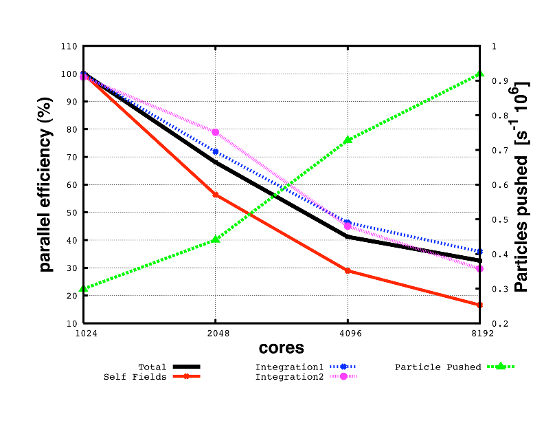
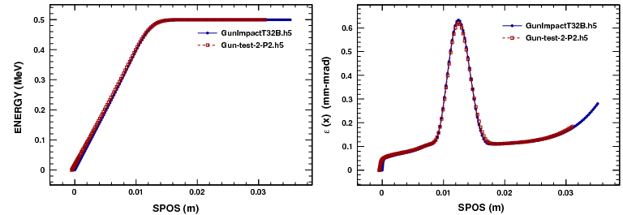

## History

Using the MAD language with extensions, OPAL is derived from MAD9P and is
based on the CLASSIC library [@classic], which was started in 1995 by an
international collaboration. IPPL (Independent Parallel Particle Layer)
provides the parallel particles and fields using a data-parallel approach and
was inspired by POOMA [@pooma].

OPAL-T can be used to model guns, injectors, ERLs, and complete XFELs.

## Project Resources and Getting Started

The public project pages collect the current landing-page material for OPAL.
The [OPAL manual](https://opalx-project.github.io/Manual/) is published online,
and the OPAL mailing list can be joined via the
[subscription page](https://psilists.ethz.ch/sympa/subscribe/opal). For a
broader overview of current use cases and publications, see
[papers and presentations](https://opalx-project.github.io/OPAL-References).

If you are starting with example problems, the following entry points are the
most useful:

- [Cyclotron examples](https://opalx-project.github.io/Examples/Cyclotron.html)
- [RF photo injector examples](https://opalx-project.github.io/Examples/RFPhotoInjector.html)
- [AWA EEX beamline examples](https://opalx-project.github.io/Examples/AWAEEXBeamline.html)
- [AWA drive linac examples](https://opalx-project.github.io/Examples/AWADriveLinac.html)
- [Regression-test examples](https://opalx-project.github.io/Examples/RegressionTestExamples.html)
- [FFA examples](https://opalx-project.github.io/Examples/FFA.html)
Users working at PSI can additionally consult
[Using OPAL at PSI](https://opalx-project.github.io/Using-OPAL-at-PSI).

## Tools

The project pages list a small set of supporting tools around the core
simulation codes:

- The [runOPAL](https://opalx-project.github.io/runOPAL.html) Python scripts allows you to run, automated, several OPAL jobs and obtain the data in a conceived way. Scans of multiple dimensions are easy to perform.                                                              
- The [pyOPALTools.md](https://github.com/OPALX-project/pyOPALTools) Python package contains many tools for pre- and postprocessing, and analysing and plotting output data.                                                                                                      
- The [Conversion Utilities](https://amas.pages.psi.ch/Tools/scripts/)

## Parallel Processing Capabilities

OPAL is built to harness the power of parallel processing for an improved
quantitative understanding of particle accelerators. This goal can only be
achieved with detailed 3D modelling capabilities and a sufficient number of
simulation particles to obtain meaningful statistics on beam properties such as
emittance, slice emittance, and halo extension.

The following example is representative:

| Distribution | Particles | Mesh | Greens Function | Time steps |
|---|---:|---:|---|---:|
| Gauss 3D | $10^8$ | $1024^3$ | Integrated | 10 |

@fig-walldrift shows the parallel efficiency time as a function of used cores
for this test example. The data were obtained on a Cray XT5 at the Swiss Center
for Scientific Computing.

{#fig-walldrift width="60%"}

## Quality Management

Documentation and quality assurance are given very high priority because
adequate documentation is a key factor in the usefulness of a code such as
OPAL for present and future particle accelerators. With source control, Doxygen
documentation, and a maintained user manual, the aim is to provide both users
and co-developers with state-of-the-art documentation.

One non-trivial test case is the PSI DC gun. @fig-guncomp1 shows a comparison
between IMPACT-T and OPAL-T.

{#fig-guncomp1 width="80%"}

Misprints and obscurity are almost inevitable in a document of this size.
Comments and active contributions from readers are therefore welcome.

## Output

The phase space is stored in the H5hut file format [@howison2010_intro] and can
be analyzed using H5root and H5PartROOT-style post-processing workflows
[@schietinger_intro]. The frequency of phase-space and statistical output is
controlled by the relevant `OPTION` statement flags such as `PSDUMPFREQ` and
`STATDUMPFREQ`.

A SDDS-compatible ASCII file with statistical beam parameters is written to a
file with extension `.stat`.

For postprocessing we recommend `pyOPALTools`, which contains many tools for
pre-processing, post-processing, analysis, and plotting output data.

## Change History

Change history is recorded in the OPAL release notes.

## Known Issues and Limitations

The current OPAL issue tracker is:

<https://github.com/OPALX-project/OPAL/issues>

## Acknowledgments

The contributions of various individuals and groups are acknowledged in the
relevant chapters. A few individuals have or had particularly strong influence
on the development of OPAL, including Chris Iselin, John Jowett, Julian
Cummings, Ji Qiang, Robert Ryne, Stefan Adam, Christian Baumgarten, J. Scott
Berg, Yuanjie Bi, David Bruhwiler, Chris Cortes, Martin Duy Tat, Matthias
Frey, Philippe Ganz, Colwyn Gulliford, Yves Ineichen, Tulin Kaman, Christopher
Mayes, Xiaoying Pang, Valeria Rizzoglio, Chuan Wang, Jianjun Yang, and Hao
Zha.

## Citation

Please cite OPAL using [@adelmann2019opal].
